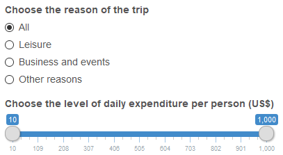

```{r setup, include=FALSE}
knitr::opts_chunk$set(echo = FALSE)
```


## Introduction

The app shows plots and a map about the main characteristics of international tourists who visited Brazil in 2016.

It shows the user information about:    

<table>
<tr>
<td>- Countries of origin</td>
<td>   </td>
<td>- Age group</td>
</tr>
<tr>
<td>- Type of accommodation</td>
<td>   </td>
<td>- Length of stay</td>
</tr>
<tr>
<td>- Travel party</td>
<td>   </td>
<td>- Daily expenditure per person</td>
</tr>
<tr>
<td>- Use of travel agencies</td>
<td>   </td>
<td>- Main destinations</td>
</tr>
</table>


It uses plotly and leaflet packages, creating an interactive, visually attractive application.

The user can filter the dataset by reason of the trip and/or level of expenditure in Brazil, using two easily manageable controls.

## Data selection
On the left panel of the app the user can filter the data by the reason of the trip and/or level of expenditure.

Using one of four radio buttons, they can choose to see the plots and the map about all of the reasons or select one of the three:    
- Leisure  
- Business and events  
- Other reasons  

Also, using a slider, the user can choose the level of expenditure of the tourists included, varying from 10 to 1000 US dollar per person and day.

<center></center>

## Plot
This is an example of the plots presented in the app. 

This one shows the type of accommodation used by the tourist. 

The user can  zoom in any selected area and mouse over the bars to look at the values, thanks to the plotly package.

```{r echo=FALSE, warning=FALSE, message=FALSE}
library(plotly)
library(dplyr)
db <- read.table("tourists.csv", sep = ";", header = TRUE, dec = ",", stringsAsFactors = FALSE)

tblHospedagem <- db %>%
        count(nomHospedagem) %>%
        group_by(nomHospedagem) %>%
        ungroup() %>%
        mutate(pct = round(n / sum(n) * 100, digits = 1)) %>%
        arrange(pct)

plot_ly(data=tblHospedagem, x = ~pct, y = ~nomHospedagem, type = 'bar', orientation = 'h',
                yaxis = list(categoryarray = ~pct, categoryorder = "array")) %>%
            layout(height = 350, margin = list(l = 200), xaxis = list(title = "(%)"), yaxis = list(title = ""))

```

## Map
The app shows a map like this one, indicating the main destinations of the tourists in Brazil.

The map responds to the selection of cases made by the user.

The user can zoom in or out and mouse over the points to see the name of the destinations.

```{r echo=FALSE, warning=FALSE, message=FALSE}
library(leaflet)
db %>% leaflet(height = 300) %>% addTiles() %>% addCircles(label = db$nomCidadeVisitada_UF)
```
